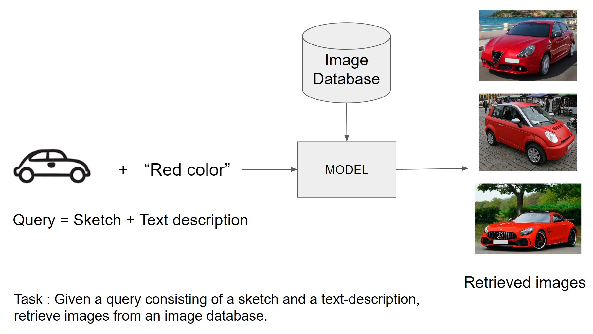

# sketch-text-image-retrieval
This repo contains code for the [Deep Learning for Computer Vision](https://www.deeplearningforcomputervision.com/) (COMS W 4995 006 Fall21) course project. The project aims to develop an image retrieval system which takes sketch + text description as query and retrieves relevant images from an image dataset/gallery.


## Requirements
* Use **python > 3.8.5**. Conda recommended : [https://docs.anaconda.com/anaconda/install/linux/](https://docs.anaconda.com/anaconda/install/linux/)

* Use **pytorch 1.10.0 CUDA 10.2**

* Other requirements from 'requirements.txt'

**To setup environment**
```
# create new env stir
$ conda create -n stir python=3.8.5

# activate stir
$ conda activate stir

# install pytorch, torchvision
$ conda install pytorch==1.10.0 torchvision==0.11.0 cudatoolkit=10.2 -c pytorch

# install other dependencies
$ pip install -r requirements.txt
```

## Training
### Preparing training dataset
Download Visual Genome images and its attribute annotations from [here](https://visualgenome.org/). Then use this [notebook](notebooks/dlcv_project_dataset_creation.ipynb) to generate dataset. (or use already generated dataset in ```data/```) 

Download imagenet-sketch dataset from [here](https://github.com/HaohanWang/ImageNet-Sketch). 

Update the dataset paths in ```configs/dataset_config.yaml```


### To train: 
```
$ python main.py --model=concat
```
Note: currently only concat composition model is added. Other model can be added later.

### To evaluate on validation dataset:
```
$ python main.py --model=concat --do_eval --checkpoint_path='path to saved model weights'
```

Here are trained weights for trained concat model: [link](https://drive.google.com/file/d/1ekDat1Pshfa2HghVCDK1VsTYuaFS8pJw/view?usp=sharing) 
Note: above drive link is only accessible from lionmail account

## To visualize retrieval:
Use this notebook by setting appropriate dataset paths: ```visualize_retrieval.ipynb```

### Acknowledgements
This repo uses some of the code from https://github.com/google/tirg modified for newer pytorch version. 